# 동감(Ditto) ✨

## 🎀 프로젝트 소개

🏷 **프로젝트 명 : 동감**

🗓️ **프로젝트 기간 : 2023.10.10 ~ 2023.11.17 (6주)**

👥 **구성원 : 공정민, 박진희, 양불회, 정현우, 최동우(팀장👑)**

---

### 🥰 서비스 구경 바로가기

🖥 **서비스 주소 : https://donggam.site/**

**🎥 소개 영상 보기 : 유튜브 링크 첨부**

---

### ✅ 기획 배경

> “같은 공간, 같은 시간 속 사람들은 어떤 모습일까?” <br/> 같은 공간과 시간 속에 있지만 무심코 곁을 지나친 사람들은 어떤 생각을 하고 있을까?
> 

우리는 늘 곁을 지나치는 많은 사람들을 만나게 되는데, 그중에는 매일 얼굴을 마주치며 서로의 존재에 대해 익숙해지는 사람들도 있다.

비록 말 한마디 해보지 못했지만, 시간이 지나면서 혼자만의 내적 친밀감이 쌓이며 저 사람들은 어떤 사람들일까, 각자 어떤 고민을 가지고 어떤 하루를 보내고 있을까 궁금해지기도 한다.

‘옷깃만 스쳐도 인연’이라는 말 처럼, 스쳐지나가는 사람들이지만, 같은 시간과 공간을 공유한다는 것은 큰 의미를 지니고 있다. 

길 위에서 만나게 될 많은 사람들을 알아가기 위한 서비스! 동감이 나오게 되었다.

---

### ✅ 서비스 소개

> 사용자들의 **위치**를 기반으로 한 **SNS**
> 
- 상태메시지를 설정해서 주변 사람들의 감정을 배경으로 확인할 수 있다.
- 시간과 공간을 기반으로 한 다양한 컨텐츠에 참여할 수 있으며 자신의 기록을 공유할 수 있다.

---

### 👥 서비스 대상

- 주변에 관심이 많은 사람들
- 익명의 누군가와 대화를 하고 싶은 사람들


## 💌 서비스 화면 및 기능 소개

### ✅ 시/공간 화면

- **닉네임 및 현재 상태메시지 설정**

> 상태메시지를 감정 분석한 후, 주변인들의 감정에 따라 배경이 변하는 걸 확인할 수 있다.

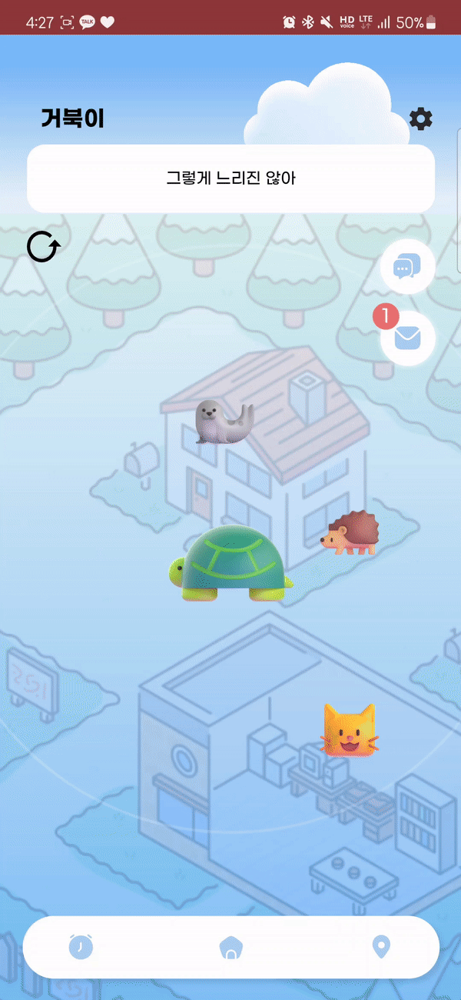


- **같은 공간, 같은 시간을 보내는 사람 찾기**

> 반경 10km 이내의 사람들 중 어플을 활성한 사람이 있으면 화면에서 확인 가능하다.


- **다른 사용자와 상호 작용**

> 1:1 채팅(양방향)과 쪽지 보내기(단방향)를 할 수 있다.


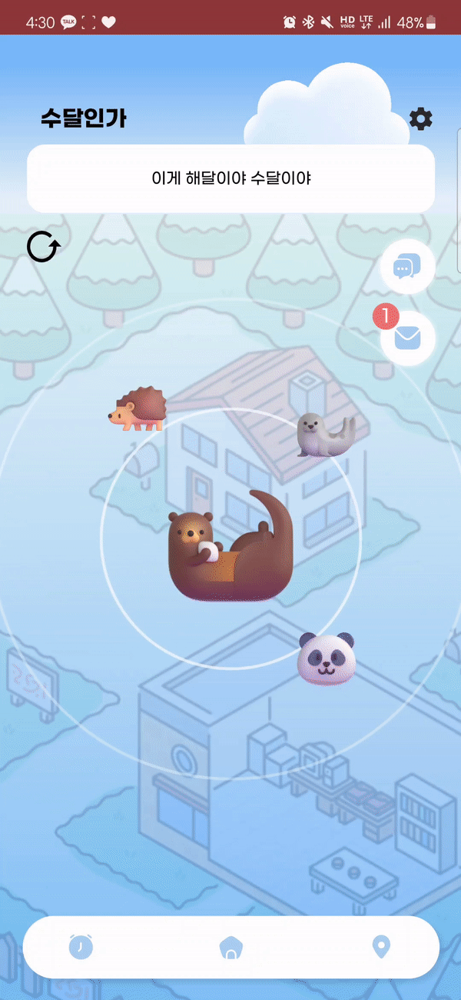

---

### ✅ 시간 화면

- **주제에 따른 사진 콘테스트**

> 시간대에 따라 바뀌는 주제에 맞춰 사진을 업로드 할 수 있다.


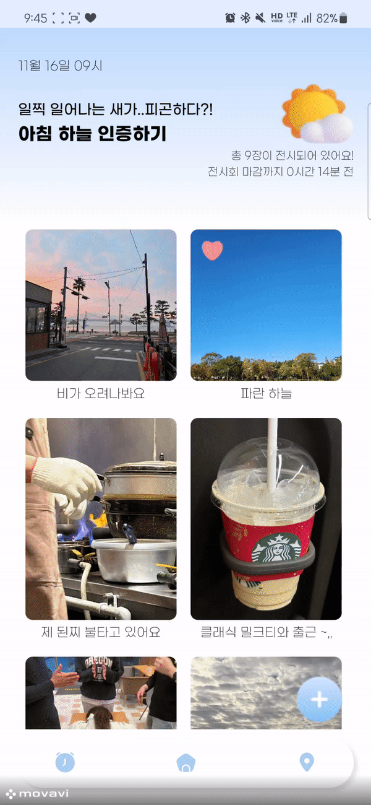


- **명예의 전당**

> 좋아요를 많이 받은 베스트 사진들을 확인할 수 있다.

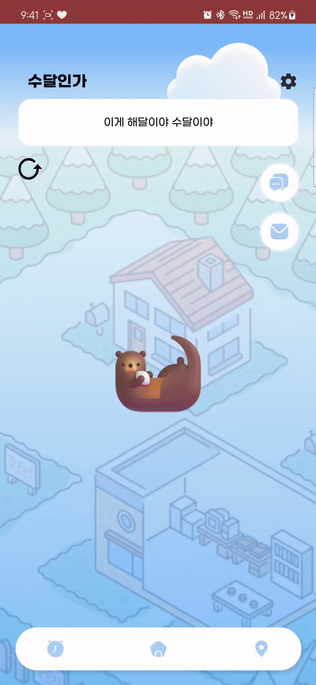

---

### ✅ 공간 화면

- **랜드마크 확인**

> 주변에 있는 랜드마크를 확인할 수 있으며, 타 지역에 있는 랜드마크를 조회할 수 있다.


- **방명록**

> 주변에 있는 방명록을 확인할 수 있으며, 지도를 통해 위치도 확인할 수 있다.


- **글 등록 및 내 방명록 확인**

> 방명록과 랜드마크 나누어서 글을 등록할 수 있고, 내가 적었던 방명록을 확인할 수 있다.


## 🛠 기술 스택

### FE
<p>
	
  
  
  
  
  
</p>


### BE
<p>
	
	
	
</p> 

### DB
<p>
	
  
  
</p>


### Dev-Ops
<p>
	
  
	
	
	
</p>


### Communication
<p>
	
	
	
	
	
	
</p>


## 🗂 프로젝트 구조

### FE

```markdown
└─📦 src
  ├─📂 api
  ├─📂 assets
  │  ├─📂 animation
  │  ├─📂 common
  │  ├─📂 fonts
  │  ├─📂 icons
  │  ├─📂 images
  │  ├─📂 landmark
  │  ├─📂 like
  │  ├─📂 mail
  │  ├─📂 timeBackground
  │  ├─📂 tutorial
  │  └─📜 kakao_login_button.png
  ├─📂 components
  │  ├─📂 character
  │  ├─📂 chatpage
  │  ├─📂 common
  │  ├─📂 landmarkpage
  │  ├─📂 loginpage
  │  ├─📂 mailboxpage
  │  ├─📂 mainpage
  │  ├─📂 spacepage
  │  └─📂 timepage
  ├─📂 pages
  ├─📂 recoil
  │  ├─📂 existingCharacter
  │  ├─📂 location
  │  └─📂 user
  ├─📂 utils
  └─📜 App.jsx
```

---

### BE

```markdown
C:.
├─📂 generated
│  └─📂 com
│      └─📂 example
│          └─📂 backend
│              └─📂 entity
│                  ├─📂 mariaDB
│                  │  ├─📂 chat
│                  │  ├─📂 member
│                  │  ├─📂 message
│                  │  ├─📂 space
│                  │  ├─📂 status
│                  │  └─📂 time
│                  └─📂 postgreSQL
├─📂 java
│  └─📂 com
│      └─📂 example
│          ├─📂 backend
│          │  ├─📂 config
│          │  │  └─📂 chat
│          │  ├─📂 controller
│          │  │  ├─📂 chat
│          │  │  ├─📂 member
│          │  │  ├─📂 message
│          │  │  ├─📂 space
│          │  │  ├─📂 time
│          │  │  └─📂 web
│          │  ├─📂 data
│          │  ├─📂 dto
│          │  │  ├─📂 chat
│          │  │  ├─📂 image
│          │  │  ├─📂 landmark
│          │  │  ├─📂 memberUpdate
│          │  │  ├─📂 message
│          │  │  └─📂 record
│          │  ├─📂 entity
│          │  │  ├─📂 mariaDB
│          │  │  │  ├─📂 chat
│          │  │  │  ├─📂 member
│          │  │  │  ├─📂 message
│          │  │  │  ├─📂 space
│          │  │  │  ├─📂 status
│          │  │  │  └─📂 time
│          │  │  └─📂 postgreSQL
│          │  ├─📂 exception
│          │  │  └─📂 type
│          │  ├─📂 jwt
│          │  ├─📂 repository
│          │  │  ├─📂 mariaDB
│          │  │  │  ├─📂 chat
│          │  │  │  ├─📂 image
│          │  │  │  ├─📂 landmark
│          │  │  │  ├─📂 member
│          │  │  │  ├─📂 message
│          │  │  │  ├─📂 record
│          │  │  │  └─📂 status
│          │  │  └─📂 postgreSQL
│          │  ├─📂 service
│          │  │  ├─📂 chat
│          │  │  ├─📂 Member
│          │  │  └─📂 message
│          │  ├─📂 type
│          │  └─📂 util
│          │      ├─📂 fcm
│          │      └─📂 mattermost
│          └─📂 scheduler
└─📂 resources
    └─📂 firebase
```


## 📜 프로젝트 산출물

### 시스템 아키텍쳐
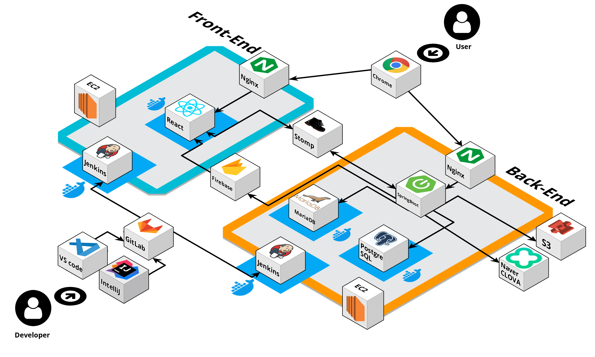


---

### ERD
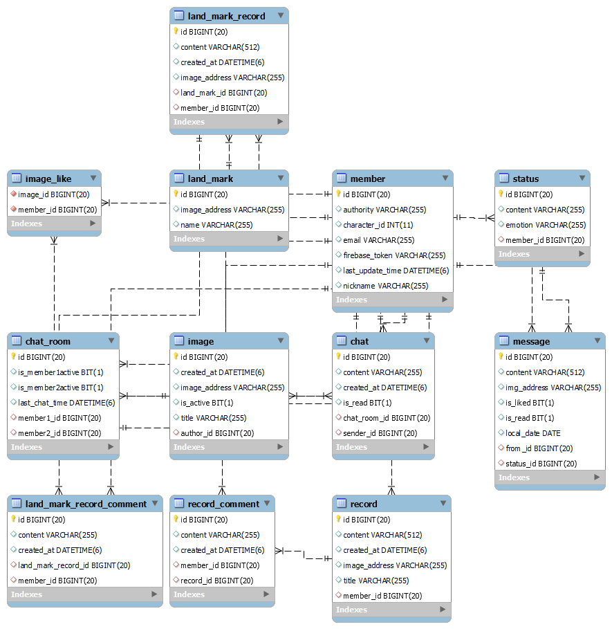


---

### API 명세서
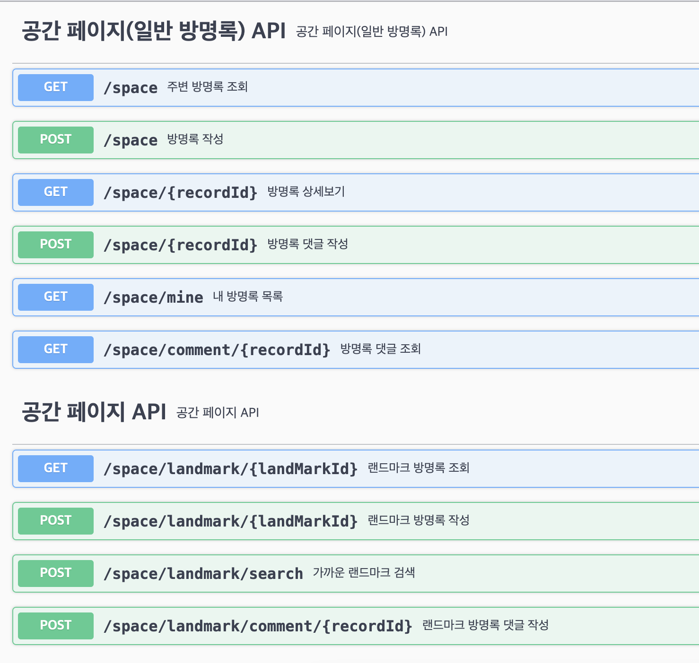
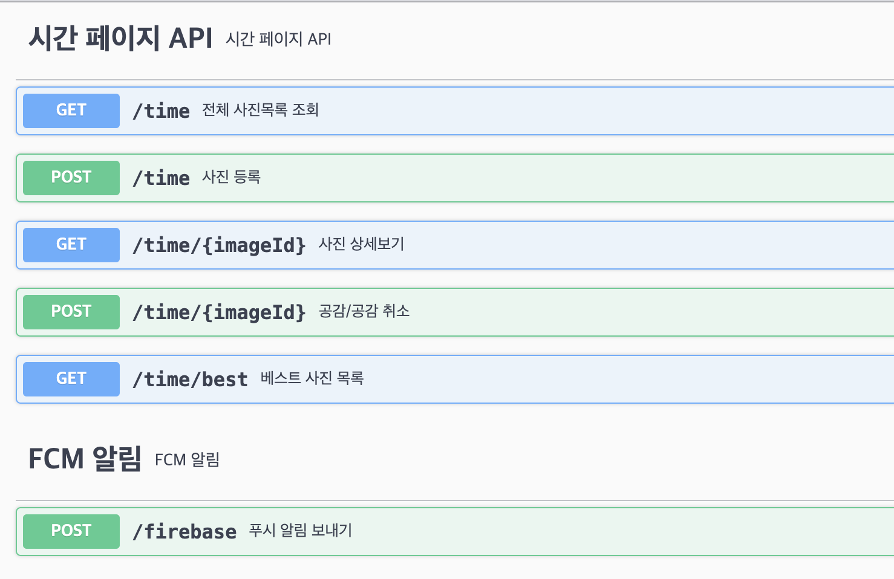
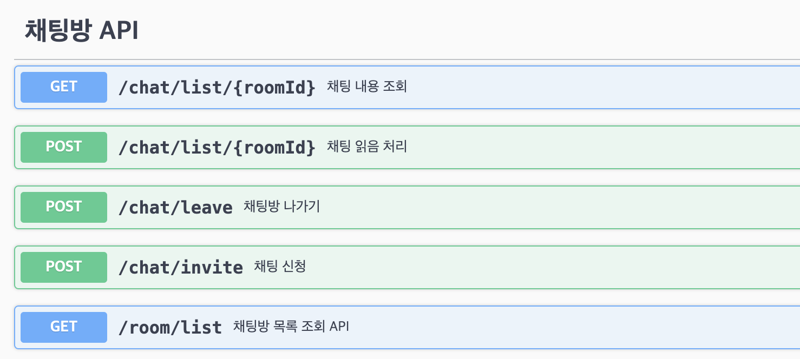
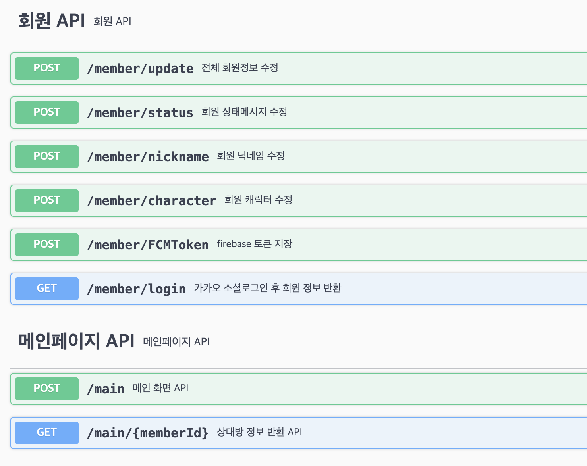
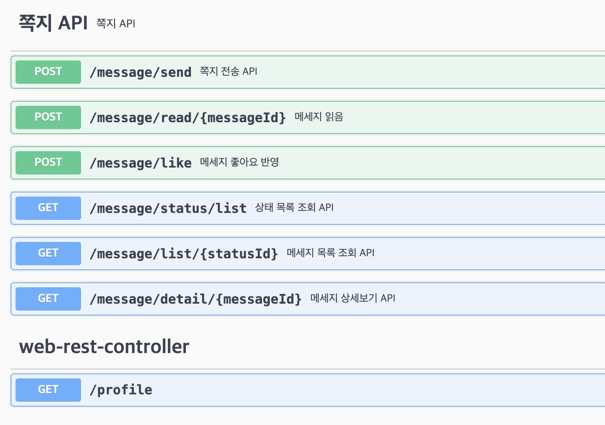


## 💙 팀원 소개
| 공정민 | 박진희 | 양불회 |
| --- | --- | --- |
| Front-End <br> 시간 페이지 구현 및 CSS <br> 전체 방명록 CSS <br> 쪽지 페이지 CSS <br> FE CI/CD 구축 및 SSL 적용 <br> 서기 | Front-End, UI/UX <br> 페이지 디자인 <br> 랜드마크 조회 및 등록 <br> 메인 페이지 구현 및 CSS <br> 주변 유저 쪽지 전송 구현 | Front-End <br> 카카오톡 소셜 로그인 <br> 일반 방명록 구현 및 CSS <br> 쪽지 페이지 구현 <br> 프로필 페이지 구현 <br> 지도 API  |
| https://github.com/jeongmin59 |  | https://github.com/zzarru |
| 정현우 | 최동우(팀장👑) |  |
| Full Stack <br> Stomp + SockJS 채팅 <br> 쪽지 및 채팅 API 제작 <br> PostGIS 공간 쿼리 적용 <br> 채팅방 페이지 css <br> 메인 페이지 구조 설정 및 css 적용 <br> 무한 스크롤 기능 구현 <br> CI/CD 구축 및 SSL 적용 | Full Stack <br> Firebase 푸시 알림 <br> Stomp+SockJS 채팅 <br> 채팅 페이지 기능 및 CSS <br> PostGIS 공간 쿼리 적용 <br> 스프링 시큐리티+JWT 카카오 소셜 로그인 <br> 메인, 시간, 공간페이지 API 제작 |  |
| https://github.com/tunkcalb?tab=repositories | https://github.com/woodong27 |  |